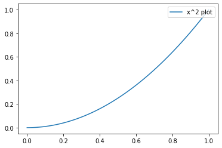

You've written some plotting codes like below.


```python
import numpy as np

x = np.linspace(0,1,100)
y = x**2
```


```python
import matplotlib.pyplot as plt

plt.plot(x, y, label = 'x^2 plot')
plt.legend(loc = 'upper right')
```


    <matplotlib.legend.Legend at 0x1ee98761248>




