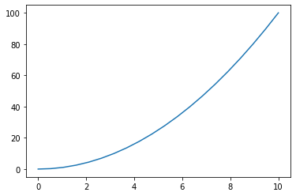
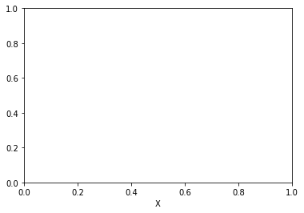
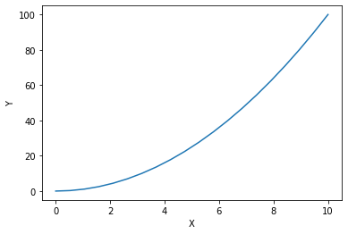
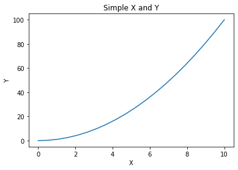
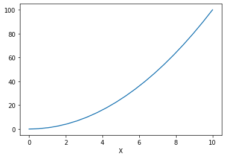

```python
import numpy as np

x = np.linspace(0, 10, 20)
y = x ** 2
```


```python
# Let's plot the relationship between X and Y
# Don't hesitate to draw plot !
```


```python
import matplotlib.pyplot as plt
%matplotlib inline
```


```python
plt.plot(x, y)
```


    [<matplotlib.lines.Line2D at 0x1e401b4fe08>]





```python
# OK, But there is no title and labels of x and y.
# Lets add them
```


```python
plt.xlabel('X')
```


    Text(0.5, 0, 'X')





```python
# Uhm... Something happened

# But's there exactly no plot at all except creating x label.
# We need to re-write plotting codes again.
```


```python
plt.plot(x, y)
plt.xlabel('X')
plt.ylabel('Y')
```


    Text(0, 0.5, 'Y')





```python
# Ah... Forgot to draw title of the plot
```


```python
plt.plot(x, y)
plt.xlabel('X')
plt.ylabel('Y')
plt.title('Simple X and Y')
```


    Text(0.5, 1.0, 'Simple X and Y')





```python
# We did that all we want draw. But this is a kind of stupid approach, isn't it?
# Let's do the same thing with object-oriented style
```


```python
fig = plt.figure()
ax1 = fig.add_subplot(1, 1, 1)
ax1.plot(x, y)
```


    [<matplotlib.lines.Line2D at 0x1e401e4d088>]


```python
ax1.set_xlabel('X')
fig
```





```python
ax1.set_ylabel('Y')
ax1.set_title('Simple X and Y')
fig
```


```python
# Isn't it more intuitive? 
# In MATLAB style coding, it's hard to adjust previous plot.
# If you want to do that, you should re-write previous code again. That's bad.
# (Actually there is a way to catch previous handle, 
#  but it should use something special. ex) ax = plt.gca()
```


```python

```
