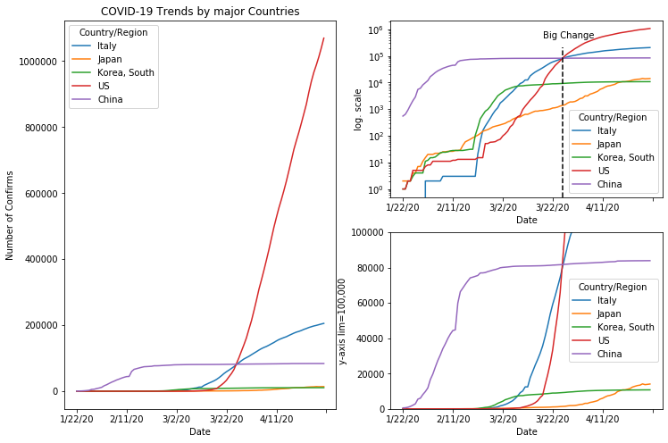

### Plotting with Pandas DataFrame


```python
import pandas as pd

# read .csv, I've downloaded csv file here. https://github.com/CSSEGISandData/COVID-19/tree/master/csse_covid_19_data
file_url = 'https://raw.githubusercontent.com/actruce/PythonLibraries/master/Matplotlib/data/time_series_covid19_gloabal.csv'
df_org = pd.read_csv(file_url)
```

Let's do some pre-processing !


```python
df_china = df_org.copy()
df_china = df_china[df_china['Country/Region'].isin(['China'])]
df_china = df_china.groupby('Country/Region').agg('sum')
df_china.drop(['Lat', 'Long'], axis=1, inplace=True)
```


```python
df = df_org.copy()
df = df[df['Country/Region'].isin(['Korea, South', 'Japan', 'US', 'Italy'])]
df = df.iloc[:, 1:]
df.drop(['Lat', 'Long'], axis=1, inplace=True)
df.set_index(['Country/Region'], inplace=True)
```


```python
df = pd.concat((df, df_china))
df = df.T
df.index.rename('Date', inplace=True)
```


```python

```


<div>
<style scoped>
    .dataframe tbody tr th:only-of-type {
        vertical-align: middle;
    }

    .dataframe tbody tr th {
        vertical-align: top;
    }

    .dataframe thead th {
        text-align: right;
    }
</style>
<table border="1" class="dataframe">
  <thead>
    <tr style="text-align: right;">
      <th>Country/Region</th>
      <th>Italy</th>
      <th>Japan</th>
      <th>Korea, South</th>
      <th>US</th>
      <th>China</th>
    </tr>
    <tr>
      <th>Date</th>
      <th></th>
      <th></th>
      <th></th>
      <th></th>
      <th></th>
    </tr>
  </thead>
  <tbody>
    <tr>
      <th>1/22/20</th>
      <td>0</td>
      <td>2</td>
      <td>1</td>
      <td>1</td>
      <td>548</td>
    </tr>
    <tr>
      <th>1/23/20</th>
      <td>0</td>
      <td>2</td>
      <td>1</td>
      <td>1</td>
      <td>643</td>
    </tr>
    <tr>
      <th>1/24/20</th>
      <td>0</td>
      <td>2</td>
      <td>2</td>
      <td>2</td>
      <td>920</td>
    </tr>
    <tr>
      <th>1/25/20</th>
      <td>0</td>
      <td>2</td>
      <td>2</td>
      <td>2</td>
      <td>1406</td>
    </tr>
    <tr>
      <th>1/26/20</th>
      <td>0</td>
      <td>4</td>
      <td>3</td>
      <td>5</td>
      <td>2075</td>
    </tr>
  </tbody>
</table>
</div>


```python
import matplotlib.pyplot as plt
fig = plt.figure(figsize=(12, 8))

ax1 = fig.add_subplot(1,2,1)
df.plot(ax=ax1)
ax1.set_ylabel('Number of Confirms')
ax1.set_title('COVID-19 Trends by major Countries')

ax2 = fig.add_subplot(2,2,2)
df.plot(ax=ax2)
ax2.set_ylabel('log. scale')
ax2.set_yscale('log')
ax2.axvline(x=64, ymin=0, ymax=0.85, c='k', linestyle='--') # add vertical line at ax2
ax2.text(0.56, 0.9, 'Big Change', transform=ax2.transAxes)

ax3 = fig.add_subplot(2,2,4)
df.plot(ax=ax3)
ax3.set_ylim([-1, 100000.])
ax3.set_ylabel('y-axis lim=100,000')
```


    Text(0, 0.5, 'y-axis lim=100,000')




