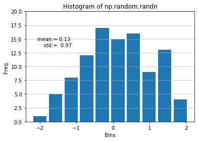
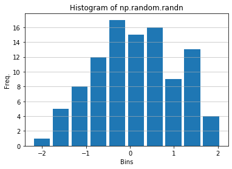

### Plotting histogram


```python
import numpy as np

normal = np.random.randn(100)
```


```python
# reference link : https://realpython.com/python-histograms/
import matplotlib.pyplot as plt

fig = plt.figure()
ax1 = fig.add_subplot(1,1,1)

ax1.hist(normal, rwidth=0.85)
ax1.yaxis.grid(alpha = 0.75)
ax1.set_ylim([0, 20])
ax1.set_xlabel('Bins')
ax1.set_ylabel('Freq.')
ax1.set_title('Histogram of np.random.randn')

mu = normal.mean().round(2)
std = normal.std().round(2)
ax1.text(0.07, 0.68, 'mean:= {}\n    std:=  {}'.format(mu, std), transform=ax1.transAxes)
```


    Text(0.07, 0.68, 'mean:= 0.13\n    std:=  0.97')





### 3.1 Making a Function to plot histogram


```python
# Reference : https://matplotlib.org/faq/usage_faq.html
def histogram_plotter(ax, data, hist_param_dict, xlabel='Bins', ylabel='Freq.', title='Histogram of data'):
    """ A helper function to make a histogram

    Parameters
    ----------
    ax (Axes) : The axes to draw to
    data (array) : The x data
    xlabel (str) : x-axis label
    ylabel (str) : y-axis label
    title (str) : title of subplot
    hist_param_dict (dict) : Dictionary of kwargs to pass to ax.plot

    Returns
    -------
    out (list) : list of artists added """
    
    ax.yaxis.grid(alpha = 0.75)
    ax.set_xlabel(xlabel)
    ax.set_ylabel(ylabel)
    ax.set_title(title)
    out = ax.hist(data, **hist_param_dict)
    
    return out
```


```python
fig = plt.figure()
ax1 = fig.add_subplot(1,1,1)

hist = histogram_plotter(ax1, normal, {'rwidth':0.85}, title='Histogram of np.random.randn')
```





```python

```
